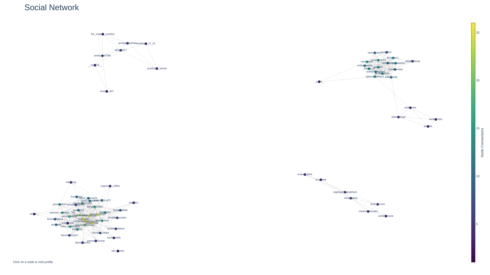
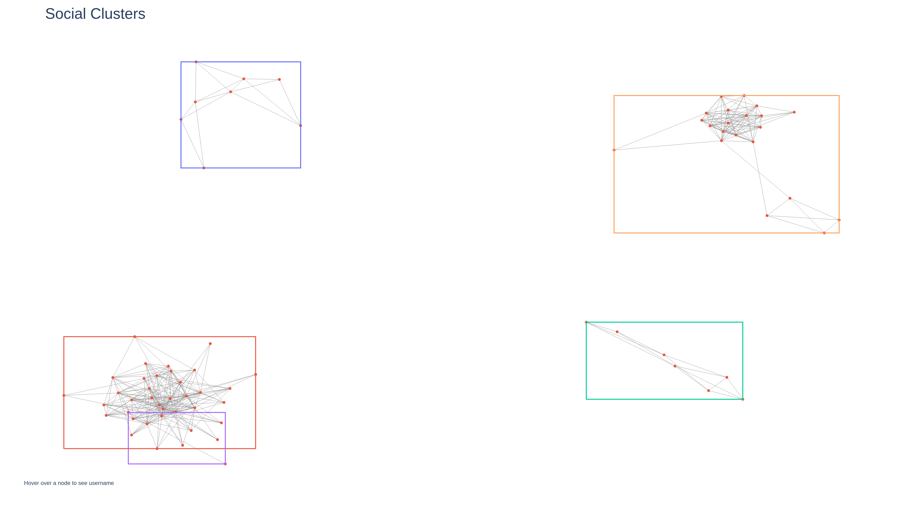

# socialnetwork

## TL;DR

```console
python main.py --username USERNAME --password PASSWORD --seed SEED
```

Generates a dynamic visualization of Instagram connections, like so.





## Dependencies

- [instaloader](https://github.com/instaloader/instaloader)
- [networkx](https://github.com/networkx/networkx)
- [plotly](https://github.com/plotly/plotly.py)
- [python-dotenv](https://github.com/theskumar/python-dotenv)

```console
pip install instaloader networkx plotly python-dotenv 
```

## Advanced Usage

If you're getting tired of entering your username and password, create a ```.env``` file in ```vars/```:

```console
src/.env
    USERNAME=your_username
    PASSWORD=your_password
    SEED=arbitrary_integer
    K=value_for_neat_graph
```

## Troubleshooting

### Instagram blocking execution

Open up [Instagram](instagram.com) in your browser. It helps immensely to
have an actual session going at the same time the script is executing.

### ```LoginRequiredException```

The issue is exactly what it says on the box. Log in to get a profile's followers.

### ```BadCredentialsException```

Wrong password or username.
